[HOW : ENTOK Platform technology & management](#how-entok-platform-technology-management)

-	[ENTOK Platform technology](#entok-platform-technology)

-	[ENTOK Platform integration](#entok-platform-integration)

-	[ENTOK Platform management](#entok-platform-management)

### **HOW : ENTOK Platform Technology & Management**

### ENTOK Platform Technology

**ERC-20 Token of smart contract based on Ethereum**

ERC-20 (Ethereum Request for Comments) is a standard for ensuring the compatibility between tokens developed on Ethereum network (blockchain). The ERC-20 must support the attributes of smart contract, and ERC-20 compliant tokens can be held in a standard Ethereum wallet (MyEtherWallet, MetaMask, Mist, etc.). This standard creates many advantages such as simplification of digital currency exchange and ultimately facilitates the development of cryptocurrency tokens. ERC-20 defines the principal functions of cryptocurrency including the method of token transfer, the method of token information request and the format of events that occur to the token. These are defined in ERC-20 by several methods. An example of methods is as follows:

```javascript
function transfer(address _to, uint256 _value) returns (bool success)
```

\'\_value\' is sent to \'address\_to\' through the transfer method. The result is either success or failure and is returned as a boolean. ERC-20 provides a standard for easily implementing functions that a single currency requires through these methods. By following the ERC-20 standard, new smart token can be created easily. Many recent Ethereum-based coins were mostly created with these conveniences. By using it along with smart contract of the Ethereum network, the process of creating new digital currency is dramatically accelerated. The transaction of digital currency issued through blockchain has main functions different from those of existing currency as follows:

```
- Transparency : Anyone participating in the transaction can track the transfer record between accounts.
- Immutability : Once a transaction is approved, it cannot be canceled and no one can interfere.
- Transcendence : Token can be transferred easily to any country in the world without restriction of space.
- Immediacy : Transfer is implemented almost immediately and can be confirmed within minutes.
```

**Patented digital currency transaction system, AnyPay** (application no. 10-2017-0096905)

System and method for digital currency transaction

This patent is about the transaction method of digital currency. It describes that digital currency holder is able to directly exchange for commodity money. Also, any error that may occur during blockchain generation can be prevented and security for transactional information can be improved. According to the embodiment of this patent, digital currency transaction process can be simplified by directly exchanging for commodity money through an exchange server. And security for transactional record can be enhanced by using a virtual POS address. Also, it can raise interests in cryptocurrency by adopting the game of cryptocurrency mining. In addition, it is possible to prevent an error that may occur in the blockchain generation process and to enhance the security for transaction details of the digital currency by changing the digital currency information based on the transaction data whose validity has been verified

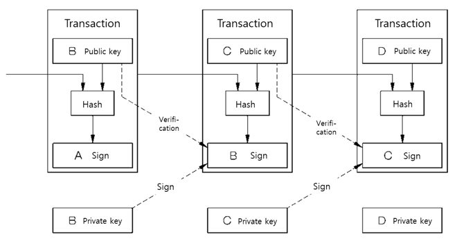

Transaction structure of cryptocurrency on blockchain

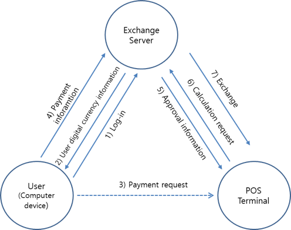

Flowchart of cryptocurrency transaction system

### ENTOK Platform integration

ENTOK Platform completes the ultimate advanced ecosystem model in four steps as follows:

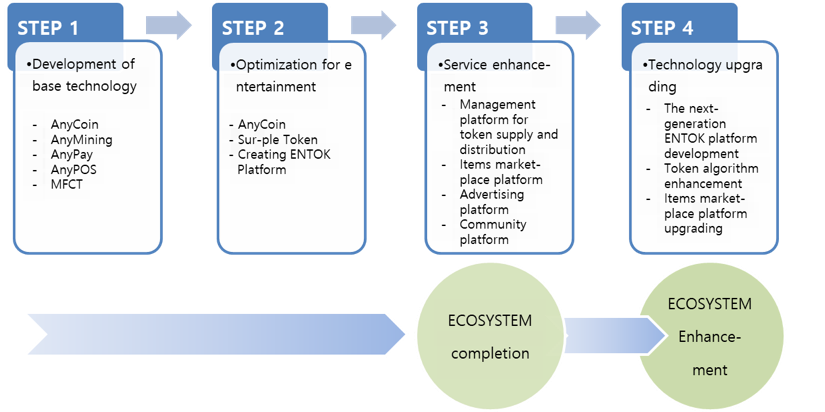

1.**STEP1 : Development of base technology**

It is the stage to develop technologies and solutions that are the base of ENTOK Platform. AnyCoin was developed with the technology of Ethereum smart contract ERC-20 Token. The technical standards of ERC-20 are as follows.

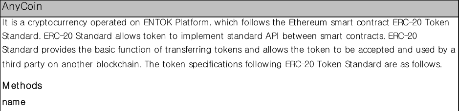

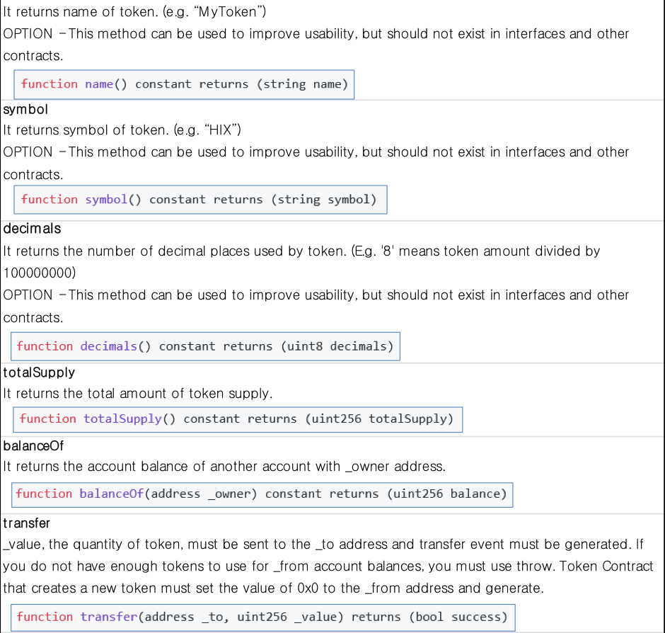

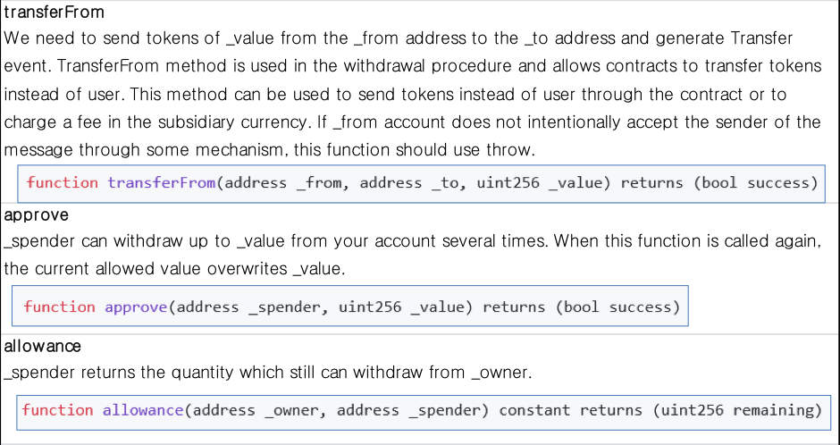

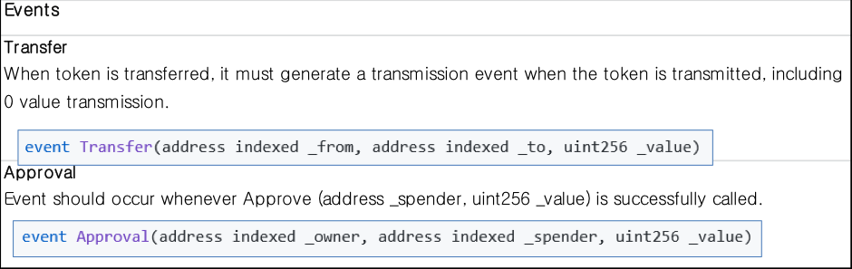

For consumers to use AnyCoin applied with ERC-20 Standard, two platforms (AnyPay for paying and AnyPOS for receiving the payment) are required.

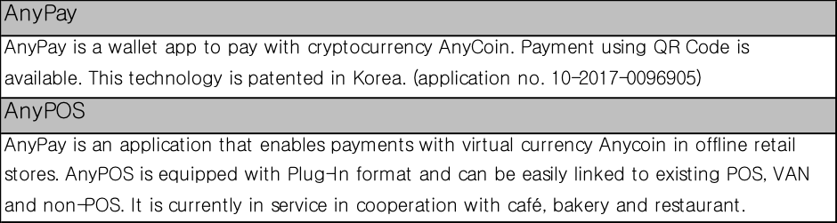

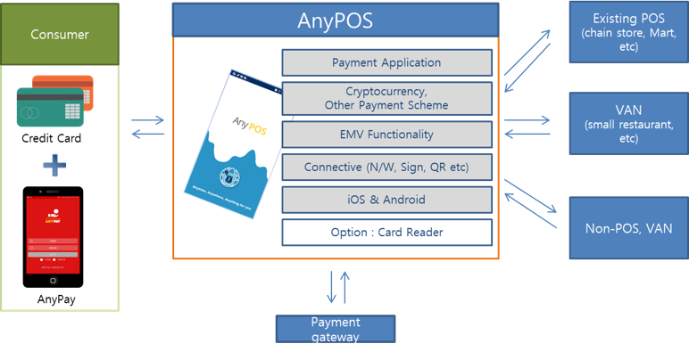

Service relation with offline retail store through AnyPay and AnyPOS

**AnyMining**

It is an application that allows anyone to easily mine AnyCoin through game. This AR (Augmented Reality) game allows collecting coins and using them like cash.

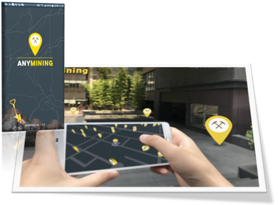

AnyCoin mining through AnyMining app.

We are also developing a solution for investment and integrated management of virtual currency, which can secure the liquidity of transaction between virtual currency and commodity.

| MFCT (Multi Function Cryptocurrency Trading System)                                                                                                                                                                                                                                                                                                                                                                                                                                                                                                                                                                                                                                                                                                                                                                                                                                                                                                                          |
|------------------------------------------------------------------------------------------------------------------------------------------------------------------------------------------------------------------------------------------------------------------------------------------------------------------------------------------------------------------------------------------------------------------------------------------------------------------------------------------------------------------------------------------------------------------------------------------------------------------------------------------------------------------------------------------------------------------------------------------------------------------------------------------------------------------------------------------------------------------------------------------------------------------------------------------------------------------------------|
| MFCT system allows cryptocurrency to be raised in initial offering and allows the ICO token that is paid in exchange for the investment to be used for actual trading. It is an integrated system of investment and management using virtual currency that can secure the liquidity of virtual currency and cash transactions. The MFCT system includes a step of accepting ICO request from a terminal of the company which wants ICO, a step of collecting virtual currency investor in cooperation with the plurality of investor terminals based on the information of the ICO company, a step of providing ICO tokens corresponding to the investment amount to the investor's terminal as a result of collecting the virtual currency investor, and a step of distributing the profit to the investor according to the result of the ICO company. Things9 has finished an application for patents for its technology. (\* Patent application number : 10-2017-0144456) |

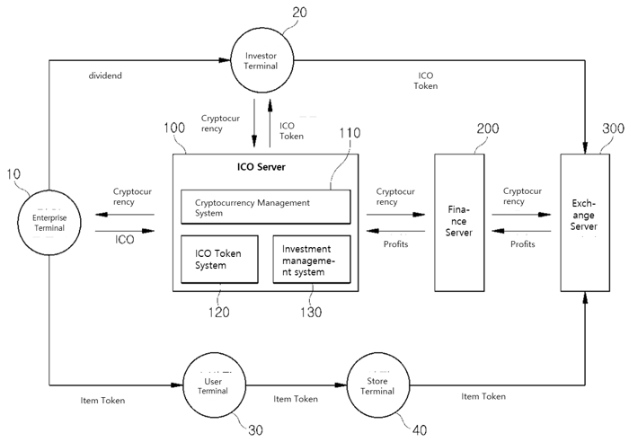

MFCT system diagram

1.	**STEP 2 : Optimization for entertainment**

A platform is established to connect the base technology built in STEP 1 with the entertainment market. At this stage, we advance the issuance of Sur-Ple Token for entertainment through the technology of AnyCoin.

| AnyCoin                                                                                                                                                                                                                                                                                                                                                                                                                                                               |
|-----------------------------------------------------------------------------------------------------------------------------------------------------------------------------------------------------------------------------------------------------------------------------------------------------------------------------------------------------------------------------------------------------------------------------------------------------------------------|
| It is a cryptocurrency developed and issued based on Ethereum smart contract ERC-20 technology. AnyCoin is registered and operated not only in MFCT(Multi Function Cryptocurrency Trading system) but also in global cryptocurrency exchanges. AnyCoin can also be exchanged with other cryptocurrency through exchanges.                                                                                                                                             |
| Sur-Ple Token                                                                                                                                                                                                                                                                                                                                                                                                                                                         |
| It is a functional cryptocurrency developed and issued based on Ethereum smart contract ERC-20 technology. Sur-Ple Token can be developed and issued for each entertainment item. When Sur-Ple Token is issued, the information of issuer and distributor (partner company) is generated and transparent transaction is guaranteed. Sur-Ple Token is a fixed value token with a fixed price. Sur-Ple Token can be extended to various markets through ENTOK Platform. |
| ENTOK Platform                                                                                                                                                                                                                                                                                                                                                                                                                                                        |
| ENTOK platform performs the following functions.\\ -Investment management\\ -Token issuance and transaction management\\ -Token listing and operating on exchange\\ -Token cross-border listing and operating on global exchange                                                                                                                                                                                                                                      |

3.**STEP 3 : Service enhancement**

A management platform is established to facilitate the supply and distribution of token. We also develop Social item marketplace platform to ensure easy accessibility for a wide range of consumers.

| Management system creating Token supply and distribution                                                                                                                                                                                                                                                                                                                                                                                                                                                                                                                                                                                                                                                                                                                           |
|------------------------------------------------------------------------------------------------------------------------------------------------------------------------------------------------------------------------------------------------------------------------------------------------------------------------------------------------------------------------------------------------------------------------------------------------------------------------------------------------------------------------------------------------------------------------------------------------------------------------------------------------------------------------------------------------------------------------------------------------------------------------------------|
| We develop a management module for token development request and token development sales table and provide to entertainment item production company. Also we develop a management module for token purchase and trade cost and provide to entertainment distribution partner company. This will allow token's market distribution process to be conducted and managed quickly.The integrated management module for supply and distribution is embedded and operated in ENTOK platform.                                                                                                                                                                                                                                                                                             |
| Social items marketplace platform creating                                                                                                                                                                                                                                                                                                                                                                                                                                                                                                                                                                                                                                                                                                                                         |
| We develop template and API and build the market-connected platform to create a marketplace where consumers can purchase various entertainment items token.Various on/off-line contents are sold and distributed by infrastructure including user through this platform.- Developing item registration template : registration and transaction of various items on marketplace - Developing item selling module : market expansion related with on/off-line sales network and social network market through providing API                                                                                                                                                                                                                                                          |
| Advertising platform creating                                                                                                                                                                                                                                                                                                                                                                                                                                                                                                                                                                                                                                                                                                                                                      |
| We create a platform for advertisements and events on the Social items marketplace. We promote the service expansion through sharing with platform, and build the optimal system using Things9's Witty solution.* Witty Witty is an app that automatically guides services through Beacon to customer who is visiting to offline stores. The customer's smartphone senses Beacon's BLE signal from the device installed at the store when visiting the store. Witty receives the current store information from the server and provides the information including available service, advertisement and event to customers. Through this, various event promotions can be performed and advertisement event using the advertisement module in the mobile platform can be performed. |

We provide convergent services which social items marketplace platform, advertising platform and community platform are interconnected.

4.**STEP 4 : Technology upgrading**

It is the stage to upgrade to the next-generation ENTOK platform. In order to integrate with various items, we enhance the algorithm of token and upgrade the function and security of platform. The main goals of upgrading are as follows:

| Token algorithm enhancement                                                                                                                                              |
|--------------------------------------------------------------------------------------------------------------------------------------------------------------------------|
| - Security improvement - Block generation, verification performance improvement                                                                                          |
| Next-generation ENTOK platform development                                                                                                                               |
| - O2O service-connected platform expansion - ERP solution-connected platform expansion - Entertainment business contract platform expansion                              |
| Service platform upgrading                                                                                                                                               |
| - Social items marketplace platform upgrading Web & mobile UI/UX improvement Mobile platform enhancement - Advertising platform upgrading - Community platform upgrading |

### ENTOK Platform Management

**Token operation**

AnyCoin can be bought and sold on the exchange.

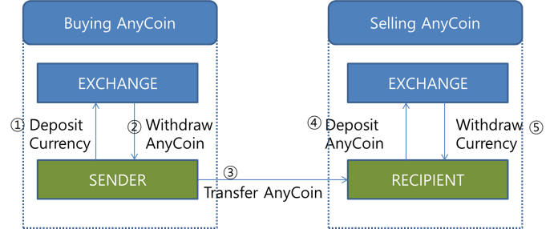

> AnyCoin sales process

Sur-Ple Token is a fixed value token that is supplied to Items Market through the entertainment production company and can be issued in multiple Token corresponding to various entertainment items. Sur-Ple Token is supplied directly to Items Market through the entertainment production company without going through the exchange.

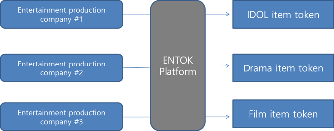

> Multiple items token operation

**Marketing operation**

There are various marketing plans which idol group "Sur-Ple" collaborates with several entertainment channels through ENTOK platform. Major marketing promotion plans are as follows.

1.**Involving the best singers of South Korea in featuring**

Involving the best singers of South Korea in featuring will attract public attention to entertainment item (Idol) and will promote brand value. At present, we are in discussions with A-Pink, EXID, Ailee and others.

2.**Appearance in broadcast program that can show skill**

It is possible to appear in several programs that can show idol's skill and it is planned to appear more than 20 times in music broadcast programs. Also it is planned to proceed with media marketing that can be contained in real-time search word list of various portals.

3.**Utilization of MCN(Internet personal broadcasting) media**

It is planned to broadcast online busking differentiated from offline busking which has many constraints such as place, time, personnel and climate. We will concentrate on proving ability and acquiring familiarity through interactive communication such as song request accepting and immediate composing.

4.**Appearance in entertainment show**

It will raise the familiarity and awareness through the appearance of famous entertainment show. It will appear in the form of a group of three "Sur-Ple" members in the MBC entertainment show \"I live alone\" and show their work environment and unique perspective, which will appeal to younger generation. Also it will participate in a song festival of MBC entertainment show "Infinite Challenge". This show has ever made the new singers famous and Sur-Ple will appear to show its composing skill and musical talent. It will appear in the SBS entertainment show "Jungle\'s Law". It is an entertainment program whose format is the survival in the wild. It is able to make the audience feel friendly through various artistic characters such as masculine beauty through hunting and healthy body or unexpected ingenuous beauty revealed during unfamiliar wild adventure.

5.**Avoid one-time fan service and aim at continuous high-quality music broadcasting**

We will continue to communicate with generations familiar with internet broadcasting including Africa TV, YouTube, etc. We will provide high-quality music broadcasting like mini concert as well as one-time fan service such as Naver V app.

6.**Collaboration with various existing platforms**

We will collaborate with existing platforms built stably such as overseas Twitch TV as well as Korean media platforms such as YouTube, Cacao TV and Naver V app.

7.**Utilization of mobile infrastructure**

Unlike offline bus king which has various limitations such as time, space and climate, we will continue to develop various promotions that can be accessed only by smart phones and thereby secure a wide range of overseas users.

**Extended operation of market**

At the time of ICO promotion, we develop and sell Sur-Ple Token for entertainment item (Idol group). The range of entertainment items is infinitely expandable. After the development of the idol group, we invest in the search and development of various entertainment items below. The categories of items will gradually expand.

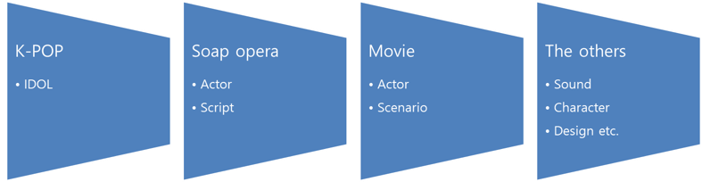

**ICO results Report and publication**

The successful ICO results and the business status are transparently disclosed through reputable organization and press media.

| - Released by global ICO report website Token Report : http://tokenreport.com |
|-------------------------------------------------------------------------------|
| - Released by official website www.sur-ple-ico.com, www.things9.com           |
| - Released by SNS Facebook, Instagram, LinkedIn                               |
| - Released by Magazine ICO world                                              |

The publication schedule will follow the Business Roadmap.
