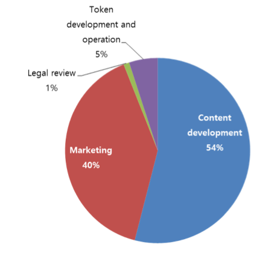
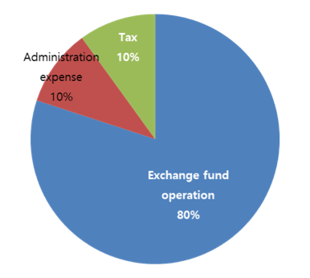

[ICO PROCEDURE : Fund-raising goal & operating plan](#ico-procedure-fund-raising-goal-and-operating-plan)

-	[ICO subject](#ico-subject)

-	[ICO target volume](#target-volume-of-ico)

-	[Fund-operating plan](#fund-operating-plan)

### **ICO Procedure : Fund-raising goal and operating plan**

### ICO subject

**The boy trio idol band Sur-Ple**

Idol group Sur-Ple is a band made up of three boys born in 1996~1997.

| Member      | Profile                                                    | Position             | Specialty                                                         |
|-------------|------------------------------------------------------------|----------------------|-------------------------------------------------------------------|
| Cha Bum-Jin | -Birth : Apr.1996 (born in Seoul) , -Body : 178 Cm / 56 Kg | Bass                 | Playing the bass and guitar,Songwriting skill                     |
| Young-Kong  | -Birth : Feb.1996 (born in Seoul) , -Body : 177 Cm / 55Kg  | Guitar & songwriting | Professional guitar skill, Playing the keyboards, Composing skill |
| Hyeyum      | -Birth : Jul.1997 (born in Seoul) , -Body : 179 Cm / 65 Kg | Vocal                | Writing and composing skill, Playing the guitar, Majored in piano |

Cha Bum-Jin | -Birth : Apr.1996 (born in Seoul) , -Body : 178 Cm / 56 Kg | Bass | Playing the bass and guitar, Songwriting skill

\- Juniors at the age of 20-21

It is made up of young members who have rooms to grow. They already have the ability to write and compose based on unlimited potential and they will be able to demonstrate their superiority through experience, effort and training.

\- Singer-songwriter with the strength of writing and composing

Each member's ability to play the different instruments and compose the songs creates a synergy effect and it is making high-quality songs based on this synergy.

\- Requests for songs from famous singers

Sur-Ple is already well known for its songwriting talent in the entertainment market and is receiving requests for songs from famous singers such as A-Pink, Ailee, and EXID.

\- Good looks

It also has a star quality based on the appearance as well as the popularity of songs.

The Idol group Sur-Ple is equipped with elements that can satisfy the needs of various fan bases including its ability to write and compose songs, excellent performance, great singing ability and good looks. Sur-Ple is currently making four songs from Part 1 to Part 4 and in the middle of 2018, it will release an album with eight songs totally, which is four songs from Part 1 to Part 4 and four new songs more.

### Target volume of ICO

ICO will be conducted for the development and successful market release of the first entertainment item, Idol Group \'Sur-Ple\', and plan to raise Ethereum equivalent of 15 billion KRW.

\- ICO Plan

> ICO promotion time : before the debut of Idol group 'Sur-Ple'
>
> ICO goal : the development of content and marketing
>
> Fund-raising term : November, 15^th^, 2017. ~ December, 5^th^, 2017.
>
> Target volume for tokens sale : 43,000 ETH (approximately 15 billion KRW)
>
> Maximum number of generated tokens : 30,100,000 ANYCOIN (refer to\*, 1ANYCOIN = 0.0014ETH)

\- Listing on exchange ; We plans to place tokens on exchanges within a month after the completion of ICO.

After the completion of ICO, ENTOK Platform business is implemented immediately and tokens based on Ethereum smart contract ERC-20 are issued. Specific methods and guidelines for participating in ICO will be announced prior to ICO start. Once investors participating in the development and support of ENTOK Platform Business send Ethereum to designated Ethereum address, Tokens are distributed to ICO investors at a rate of 700 AnyCoin per 1 ETH in real-time. AnyCoin is issued as soon as ETH deposit is confirmed during the ICO. AnyCoin received by investor can be traded on the exchange where it is listed after the completion of ICO.

### Fund-operating plan

The target volume of ICO is 43,000 ETH equivalent to 15 billion KRW, of which 60% is used for content development and marketing and 40% is used for the operation of exchange.

**Content development & marketing : 60% of ICO funds (25,800 ETH)**



Sixty percent of ICO funds are a content development budget and fifty-four percent of that budget is used to produce high-quality idol groups through the search and development of Hallyu entertainment item (idol). We will proceed with the following activities to produce outstanding idol groups.

```
-Idol training
-Album producing (featuring, on-line studio, cover photograph)
-promotion video
```

Forty percent of the content development budget is used for various activities and strategic marketing of idol group.

```
-Twice-yearly promotion for an idol(refer to roadmap)
-Rapid publicity through social network and multilateral media marketing
-Broadcasting activity (supported of costume, stylist, activity expense, vehicle, bodyguard, etc.)
```

One percent of the content development budget is used for business legal review by a professional legal advisory committee.

Five percent of the content development budget is used for development and operation of Token. It is the cost of token issuance and transaction process management. It includes the operation of server, database system, storage, security solution and security network that make up the exchange. The issued Token is registered for the trading and both WEB and mobile interface for Token trading are provided. This budget includes the cost of development manpower operation and development system operation.

**Exchange fund(deposit) operation : 40% of ICO funds (17,200 ETH)**



Forty percent of ICO funds (hereinafter referred to as \"exchange fund\") will be allocated to a deposit and used for the exchange operation including Token issuance. Eighty percent of this exchange fund is issued in Tokens and those are registered in the exchange. Registered tokens can be traded between investors and individuals. Ten percent of the exchange fund is used for the administrative expense of this business. Each allotment of ICO funds raised includes 10% tax.
