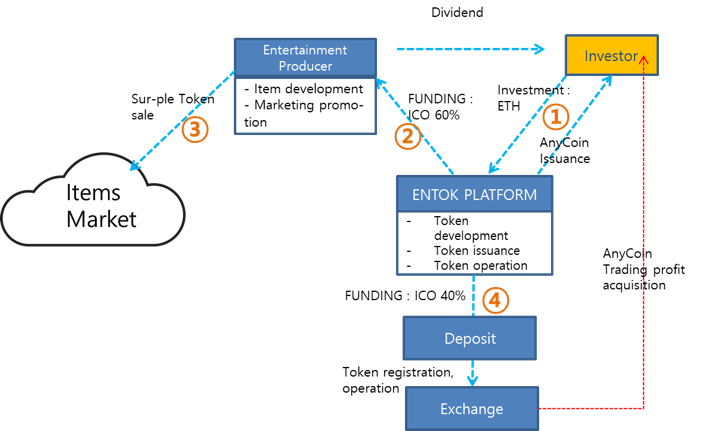

[WHAT : ENTOK Platform business model](#what-entok-platform-business-model)

-	[Whole process of ENTOK Platform](#whole-process-of-entok-platform)

-	[Platform process definition & detail](#platform-process-definition-detail)

-	[AnyCoin & Sur-Ple Token](#anycoin-sur-ple-token)

-	[Economic and social effects of ENTOK Platform](#economic-and-social-effects-of-entok-platform)

### **WHAT : ENTOK Platform business model**

### Whole process of ENTOK Platform

ENTOK is a transparent and reliable platform which supports investors, entertainment producers and exchanges.

### Platform process definition & detail

1.**The relationship between investor and ENTOK Platform**

The investor deposits Ethereum(ETH) to the ENTOK wallet. ENTOK Platform will pay AnyCoin to the investor in real time when ETH investment is confirmed. AnyCoin is sent to the investor\'s wallet in proportion to an amount of ETH invested.

2.**The relationship between ENTOK Platform and entertainment production company**

60% of the raised fund will be allocated to an entertainment production company for the development and marketing of entertainment contents. The entertainment company secures funds through the allocated ETH. The company develops and promotes entertainment items with secured funds. The entertainment company will request ENTOK Platform to issue Sur-Ple Token for the developed entertainment items. ENTOK Platform issues Sur-Ple Token and supplies it to the entertainment production company.

3.**The relationship between entertainment production company and Items Market**

Items Market is an on/off-line commerce channel where entertainment products such as merchandising, game, music, movie, promotion video, performance and ticket can be traded.

While Things9 creates and operates a social Item Marketplace platform, entertainment production company supplies and sells Sur-Ple Token to Items Market. Sur-Ple Token supplied to Items Market are used to purchase entertainment items.

4.**The relationship between ENTOK Platform and exchange**

Shortly after the end of ICO, 40% of the raised fund will be allocated to the deposit. AnyCoin equivalent to the amount of deposit will be issued. The issued AnyCoin will be registered on an exchange. AnyCoins registered on the exchange can be traded by regular investors and ICO investors on the exchange. The price of AnyCoin is adjusted through the exchange (market).

### AnyCoin & Sur-Ple Token

Two types of token, AnyCoin and Sur-Ple Token, are issued and operated in ENTOK platform business.

**AnyCoin**

AnyCoin is issued through ENTOK Platform. AnyCoin has to be issued as a single token. AnyCoin is distributed to the investor in real time. Once AnyCoin lists on the exchange after the end of ICO, the investor who holds AnyCoin can trade on the exchange. 40% of the investment allocated to a deposit will be issued with AnyCoin and registered on the exchange. AnyCoins registered on the Exchange can be traded only on the exchange by investors and individuals. The value of the AnyCoin is changed by the trading market. AnyCoin can be purchased with other Coins.

**Sur-Ple Token**

Sur-Ple Token begins to be issued at the request of the entertainment production company. Sur-Ple Token is sold and supplied to Items Market through an entertainment production company. Multiple tokens can be issued per item. Sur-Ple Token is a fixed value product and is not affected by the market. Sur-Ple Token cannot be traded between individuals.

### Economic and social effects of ENTOK Platform

**Social effects**

Because blockchain technology is applied to Sur-Ple Token issued by ENTOK, the issuance is transparent and the transaction record can be verified in all processes of distribution and consumption and consequentially, it keeps the consumer's risk at minimum. The transaction ledger based on blockchain technology enables transparent and reliable transactions between entertainment agencies and partners. Because of these characteristics, the dividend information based on profit generated by the project is open transparently to the investors, ensuring the continued reliability between investors and entertainment producers.

**Economic effects**

Frauds are frequently occurring in off-line and online transactions because existing paper gift cards and new-type gift cards (mobile gift cards, mobile coupons, etc.) are easy to forge and falsify.

As of 2016, gift card market of South Korea is estimated to reach 11.3 trillion KRW. The issuance of paper gift cards is estimated to be worth more than 9.6 trillion KRW according to the data from Korea Minting and Security Printing Corporation and the estimated value of new-type gift cards is expected to exceed 1.7 trillion KRW according to the survey from National Assembly Research Service. Smart contract ERC-20 Sur-Ple Token based on blockchain has an unlimited potential as an effective alternative to existing paper gift cards and new-type gift cards by enhancing security, transparency and reliability. Also, in the case of paper gift cards, it takes a lot of cost and time to issue, distribute and collect. With Sur-Ple Token, this cost is close to zero. Through high-performance system and Internet infrastructure, the whole process of issuing and distributing can be done instantly. In the case of existing paper gift cards and new-type gift cards, it is no small burden on traders due to high commissions. Sur-Ple Token is providing a lot of profits for traders through its low commission policy.
