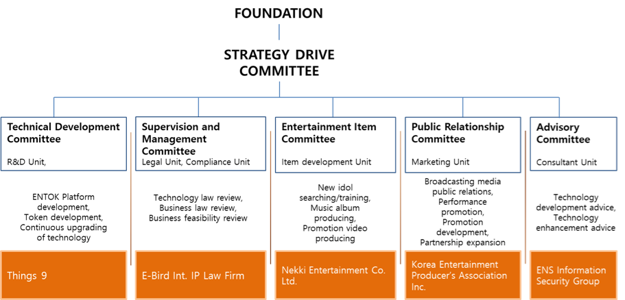
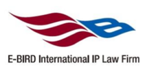
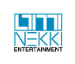

[WHO : Making ENTOK Platform more concrete](#who-making-entok-platform-more-concrete)

-	[Technical Development Committee](#technical-development-committee)

-	[Supervision and Management Committee](#supervision-and-management-committee)

-	[Entertainment Item Committee](#entertainment-item-committee)

-	[Public Relationship Committee](#public-relationship-committee)

-	[Advisory Committee](#advisory-committee)

### **WHO : Making ENTOK Platform more concrete**

ENTOK platform has been completed through cooperation with various expert groups in order to ensure stable investment process in connection with entertainment items.

### Technical Development Committee

Things9 develops and continuously upgrades ENTOK platform and encryption token. David Naccache, a professor of École normales supérieure of France and an expert on virtual currency is a technical advisor of the committee.

**Jongbum Im**

Founder & CEO of Things9

Specialist in blockchain and cryptocurrency technology

Development and launch of AnyCoin, AnyPay, AnyPOS

Specializing in convergence of technology and business in various fields

Korea University, MBA

**Hyeseong Yun**

Co-representative & Cofounder of Things9

Ex-ceo of YS Mobile Co., Ltd.

Ex-executive director of YS Consultant Co., Ltd.

**Bonghyeon Seo**

General director of overseas marketing, Things9

General manager of AnyPay service for Japanese market.

General manager of AnyPay service for American market.

### Supervision and Management Committee

It is responsible for the technical and business review of the project. It also reviews the validity throughout the project.

**E-Bird International IP Law Firm**.

Specialized agency for technology law in intellectual property right

Domestic and foreign application for patent and utility model registration

Protection of business model, analysis of rights infringement, technology transfer intermediation and technology evaluation

Precedence technical research, corporate intellectual property rights management and strategy establishment, contract writing and review.

### Entertainment Item Committee

It continues to search and train new face entertainment items. It trains the selected item at a high level and produces albums and music videos.

**Nekki Entertainment Co. Ltd.**

Started as A-One Entertainment in 2003 and established as a subsidiary of Nekki Entertainment in 2011

Produced Buzz 1^st^, 2^nd^, 3^rd^ album, digital Single album, Buzz Special album, Min Kyung Hoon 1^st^ album and Icon Eyes 1^st^ album

Bongsung Park, CEO of Nekki Entertainment Co., is called the Midas touch of record industry and is striving to find new idol through continuous audition.

### Public Relationship Committee

Through various broadcasting media and on/off-line channels, it promotes public relations and marketing of new entertainment items. It plans the performance of entertainment items and promotion with various media and fans. It will also continue to expand partnership with entertainment organizations.

**Korea Entertainment Producer's Association Inc.**

Established in 1992, Registered organization of the Ministry of Culture, Sports and Tourism in South Korea.

It consists of 354 members who are leading producers of music and performance and management specialists in the entertainment industry. 2,000 managers and 2,500 artists from member companies are working. As a sponsor of Hallyu Dream concert, it has held large-scale music performances such as Environment concert, Dream concert, and Hallyu Dream concert in order to cultivate the people\'s cultural life and popular music. It continues to build the infrastructure of popular music industry and promote the rights and interests of member producers.

### Advisory Committee

It is responsible for the advice on technology development and enhancement of ENTOK Platform.

**David Naccache**

Cryptographer and currently a professor at École normale supérieure, France

Ex-professor at Panthéon-Assas University

Ph. D at École nationale supérieure des telecommunications, France

Specialize in Public-key cryptography including the cryptanalysis of digital signature schemes

Design of Naccache-Stern cryptosystem and Naccache-Stern knapsack cryptosystem
