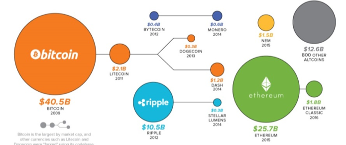
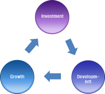
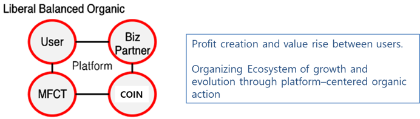
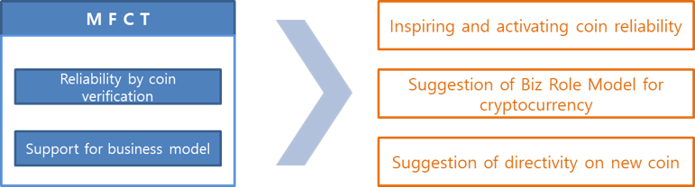

[WHY : Cryptocurrency into the entertainment market](#why-cryptocurrency-into-the-entertainment-market)

-	[Current status and prospect of Hallyu entertainment industry](#current-status-and-prospect-of-hallyu-entertainment-industry)

-	[Change of fund-raising way : ICO](#change-of-fund-raising-way-ico)

-	[Solution for entertainment market with cryptocurrency](#solution-for-entertainment-market-with-cryptocurrency)

-	[Securement of primary base technology](#securement-of-primary-base-technology)

### **WHY : Cryptocurrency into the entertainment market**

As a variety of creative businesses are emerging, those are combining their products with IoT environment and utilizing it as a stepping stone to grow. On the other hand, Hallyu entertainment market is built around large entertainment agency, which is not adequately adapted to find and nurture various entertainment items and to enter the market. Things9 aims to consider these issues together and look for solutions through the convergence of technology and culture.

### Current status and prospect of Hallyu entertainment industry

Let\'s observe the current status of South Korea, which sets regulatory barriers interrupting the development and growth of various entertainment items. Even if an idol group, great item, is formed, it is difficult to commercialize the product except for large agencies due to limitations in infrastructure such as idol group development, fund-raising, operation and marketing. On the other hand, the international situation is acting as a serious variable for large agencies. The economic impact of Chinese retaliation over THAAD and Japan\'s anti-Korean sentiment has been more than expected. The economic damage of South Korea due to a boycott on Korean product is estimated at 8.5 trillion KRW according to statistics. There is no proper countermeasure to cope with international circumstances and economic issues. Especially, small and medium sized entertainment companies are having difficulty in finding solutions for funds and human resources for globalization. Consequentially, it is inevitable to have investment plans that will continue to search for high-quality entertainment items aimed at global market, which are not limited to specific countries in Hallyu entertainment market.

### Change of fund-raising way : ICO

Previously, venture capital has been a wide spread medium of fund-raising. Currently, the development of block chains and cryptocurrency technology is changing trend across business fund-raising. Now it is possible to attract Korean and global investments in a short period of time through the Internet and mobile device. It brings about change not only in the raising method, but also in the size of the investment. The size of investment through ICO has already overtaken that of existing venture capital. Bitcoin is now at the \$5,000 mark in 2017 and there has been increasing interest in cryptocurrency around the world. As of September 25^th^, 2017, the global virtual currency market is worth about \$130 billion (approximately 150 trillion KRW).

> 
>
> CryptoCurrency Universe *(source: Coindesk, coinmarketcap.com. Market caps retrieved on June 27^th^, 2017)*

Initially, ICO investments focusing technological aspect of cryptocurrency were the vast majority, but now it continues to be successfully invested in ICO of various technology and service sectors. In the case of 2017, the amount of funds through ICO reached \$2.2billion in nine months. We will review the success cases of representative ICO.

| ICO           | Target volume | Feature of platform                                     |
|---------------|---------------|---------------------------------------------------------|
| GNOSIS        | \$12,000,000  | Combining market prediction with finance                |
| CryptoTickets | \$23,000,000  | Combining ticket sale with finance                      |
| KIK           | \$100,000,000 | 　                                                      |
| Tezos         | \$230,000,000 | Cryptocurrency Core Tech                                |
| ALIS(Japan)   | \$350,000,000 | Social media for Japanese who do not rely on commercial |
| FileCoin      | \$260,000,000 | Earning fees in exchange for lending PC capacity        |

Success cases of global ICO

Globally, it has been attempting to integrate various business platform developments and services utilizing blockchain and the increase of value cognition is consistently leading to the increase of ICO. As you can see in the Gartner report (2017) mentioned previously, blockchain technology has stepped into the stabilization stage and is universally applied in a diversity of fields. Various policy changes have been detected in South Korea and overseas. As the policy becomes specific and stable, the ICO market will grow rapidly. The key to investment success in ICO is to find a convergence model with other concrete business. Things9 was able to find a solution in Hallyu entertainment market.

### Solution for entertainment market with cryptocurrency

Entertainment producers are attempting the change to the direction of creating brand value across cultural content beyond existing record production planning and management. In order to develop a variety of high-quality entertainment items keeping up with the changes in the management trends, it is necessary to establish an environment and foundation in which investments can flow freely, which is not concentrated in large-scale agencies. Things9 desires to find a solution for Hallyu entertainment market in the latest technology based on blockchain.

**Things9 have sought business ecosystem model which combines entertainment market with reliable cryptocurrency technology.**

The most desirable business ecosystem model that Things9 pursues is a virtuous cycle model of investment, development and growth, which leads to reinvestment.

> 
>
> Virtuous cycle business model that Things9 pursues

A lot of resources are needed to find and develop high-quality entertainment items. ICO provides the most effective investment environment for finding and developing entertainment items. The investment funds raised through ICO will be used to develop items and the distribution and sales of the outstanding items will lead to the growth of both entertainment producers and investors. The growth of producers and investors will continue to expand the infrastructure that can lead to reinvestment in the development of entertainment items, consequentially completing the ideal business ecosystem. Things9 assures that ENTOK platform plays a leading role in providing this virtuous cycle model in Korea and abroad. ENTOK platform already secured a sufficiently reliable technology and is able to carry out business immediately through expansion of its associated infrastructure. We are convinced that it will be one of the most successful models that will yield a result in the shortest period of time shortly after ICO.

**The investment of cryptocurrency based on blockchain is the most democratic investment model with the advantage of high potential.**

Cryptocurrency has no government regulators. The circulation, verification, and management of currency can be done autonomously because the cryptocurrency market is steadily growing on the basis of its reliable technology. This is reflected in the fact that the daily trading volume of cryptocurrency market in South Korea is about 2.6 trillion KRW, which is equivalent to that of KOSDAQ market. It does not mean simply that the market is growing but it means that the market is maturing. What is the strength of ICO which makes the market mature? It is based on a solution that supports scalability and rapid transaction in a robust IT infrastructure. ENTOK is the best solution for discovery, production, distribution and consumption of entertainment that investors, entertainment producers and consumers can use when and where it is needed.

### Securement of primary base technology

Things9 has developed all the necessary base solutions for market invigoration and will focus on collaborating with related organizations to raise fund and develop entertainment items through ICO. The following is the base solutions developed by Things9.

**AnyCoin**

Anycoin is a cryptocurrency implemented through ERC-20 Token technology of smart Contract based on Ethereum. It has acquired technology to issue AnyCoin and Sur-Ple Token by applying Ethereum-based ERC-20 Token technology.

**AnyPay**

AnyCoin can be paid with AnyPay (Wallet) in a lot of merchants. Various AltCoins can be used to make payment at the participating merchant using AnyPay. In addition, it is possible to transfer between digital coins through smart contract ERC-20 Token technology.

**AnyPOS**

AnyPos is a payment application for business use that is serviced to member store handling AnyCoin.

**MFCT** (Multi Function Cryptocurrency Trading system)

MFCT is an exchange system under development that enables buy and sell issued Token. MFCT is aiming to provide services that maximize the value of coins by providing a \'transparent and reliable\' business model that utilizes blockchain functions.

> 
>
> Trading system as an ecosystem that can gain mutual benefit

MFCT is an open system made up of platform operators, users, and Biz partners. The system supports the application of the proven coin and Biz model and the ecosystem can continuously grow and evolve through the organic interaction between the exchange and the coin registrant.

> 
>
> Pursuing value of MFCT
