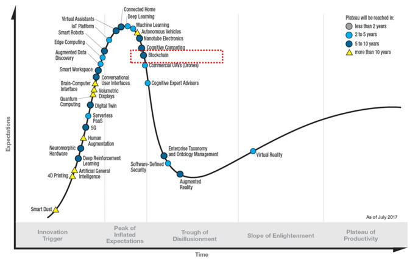
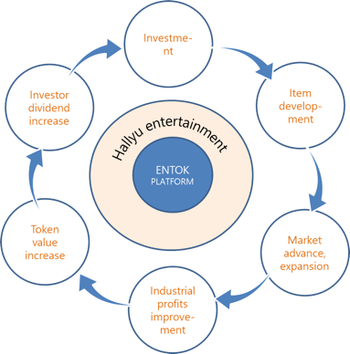

-	[Value for investors](#value-for-investors)

-	[Value for Items Market](#value-for-items-market)

-	[Proposal of the vision for new ecosystem to entertainment market](#proposal-of-the-vision-for-new-ecosystem-to-entertainment-market)

"Blockchain into the Entertainment Market"

Investment platform for Entertainment based in blockchain

**ENTOK** (Entertainment Token) **Platform**

**Executive Summary**

Led by IoT, Social Media Networks, fintech, and blockchain, wind of change in the 4^th^ industrial revolution is blowing fiercely. Especially, all eyes are watching at blockchain technology (armed with the advantage of decentralization, transparency, security, etc.) and cryptocurrency sector; the technology is gradually becoming more stable and wide spread.

> 
>
> Gartner Hype Cycle for Emerging Technologies, 2017

Entertainment industry is one of the fastest growing segments, just as swift as the development of the technology.

> 
>
> Stages of development in Hallyu culture content and imports and exports figure of cultural service

There is a good outlook for Hallyu entertainment industry which is continuously creating values based on creative ideas. World-famous singer Psy\'s \"Gangnam Style\" has played a significant role in reconsidering nation brand as well as creating tremendous economic value. K-Pop which plays a leading role of Hallyu entertainment is no longer just a recreation to listen, watch or enjoy. It has become a solid platform for the world entertainment content market as well as a bridge linking between countries or generations. For instance, EXO, a famous idol group (genuine Korean expression for a pop band), is evaluated the economic value of over 1 trillion KRW in the next decade and similarly, the social and economic value of Hallyu entertainment is expected to be larger than any other. Consumer responses are also changing. The market is increasingly anxious for the talented musicians. Since 2014, the public's expectations have been high and various broadcast audition programs have demonstrated that the successful applicants have the talents for singing, dancing and composing.

This change in Hallyu entertainment market, especially in idol market, raises K-POP cultural standard and leads global value improvement and global market extension. On the contrary, successful business remains the malformed structure which depends on the ability of large agency. This is also why we need a leading investment model for continuous research and development of high-quality Entertainment Items[^1] for the growing global market. ENTOK platform is close to the ideal investment model where technology and culture can be effectively integrated. ENTOK platform enables the investment of the entertainment market, improves the life cycle of Hallyu content and leads the new fandom culture through issuing and trading the first Token based on blockchain for Hallyu entertainment items, which presents a new direction to entertainment industry.

ENTOK platform pursues real value on business as follows:

### Value for investors

Funds raised from Investors are used in entertainment business promotion and Token[^2] operating. Investors will receive dividends from the revenue generated through the commercialization of items by entertainment agency. Investors can earn profits by selling their token directly on the exchanges.

### Value for Items Market

Token based on blockchain technology ensures transparency throughout its purchasing, distribution and consumption processes. Transparent operation and report of token distribution provide credibility for both investors and buyers. Token issued through ENTOK cannot be falsified and altered, ensuring reliability in the market. Continuous research and development of various entertainment items guarantee scalability into the broader market.

### Proposal of the vision for new ecosystem to entertainment market

ENTOK platform supports continuous development and improvement of high quality Hallyu entertainment contents as well as creation and sale of entertainment exclusive token.

> 
>
> ENTOK Platform ecosystem

Business convergence through ENTOK platform presents a virtuous cycle model of new value investing and content developing across the entertainment business ecosystem. Market conditions in the distribution of Hallyu entertainment items through blockchain-based cryptocurrency have been fully established for Korean and foreign consumers in their 10 ~ 30s who are rapidly acquiring IT technology and are immediately responding to Hallyu content. It is considered as a very attractive investment field.
